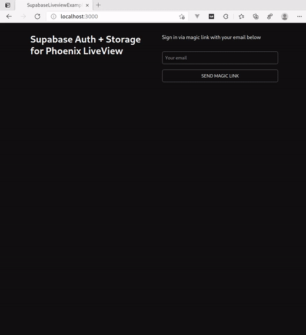

# SupabaseLiveviewExample

A Phoenix LiveView example application similar to the Supabase [Next example](https://github.com/supabase/supabase/tree/master/examples/nextjs-ts-user-management)



Code is currently pretty messy and there's no error handling and such things,
was just interested if I can get this working with [supabase-elixir](https://github.com/supabase/supabase/tree/master/examples/nextjs-ts-user-management).

## Prerequisites

Needs a Supabase project that has to be set up like described [here](https://github.com/supabase/supabase/tree/master/examples/nextjs-ts-user-management#build-from-scratch).

## Running the Service

```bash
cd assets
npm i
cd ..
mix deps.get
export SUPABASE_URL="***"
export SUPABASE_KEY="***"
mix phx.server
```
